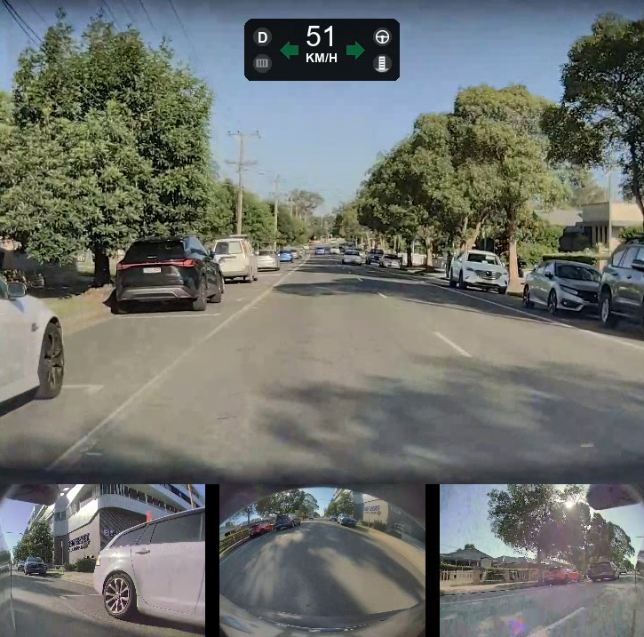

# Tesla Dashcam Telemetry Viewer

Processes Tesla dashcam MP4 files and accompanying CSV telemetry files to produce a combined multi-camera video with real-time telemetry overlay.

---

## Features
* **Multi-cam Sync**: Automatically stitches Front, Rear, and Side Repeater clips into a single frame.
* **Batch Processing**: Ability to add multiple sets of clips to be processed into one large video automatically in order of timestamp.
* **Telemetry Overlay**: Real-time visualization of:
	* Speed
	* Gear selection
	* Steering wheel angle
	* Turn signal state
	* Accelerator pedal position
	* Brake pedal state
	* Self driving state

## Layout




## Prerequisites
1. **Python 3.10+**: Check version with `python --version` in a terminal window.
2. **FFmpeg**: Required for video encoding. Verify with `ffmpeg -version`.
3. **Telemetry Data**: This tool requires `.csv` data exported via the [Tesla SEI Explorer](https://teslamotors.github.io/dashcam/sei_explorer.html).

## Installation

1.	**Clone this repository**:
    ```bash
    git clone [https://github.com/JeandreRoux/tesla-dashcam-telemetry-viewer.git](https://github.com/JeandreRoux/tesla-dashcam-telemetry-viewer.git)
    cd tesla-dashcam-telemetry-viewer

2.	**Install dependencies**:
	```bash
	pip install -r requirements.txt
	```
3.	**Install FFmpeg (if not already installed)**:
	* **Windows**:
	1. Open PowerShell as Administrator (Right-click the Start button > Terminal Admin)
	2. Run the following command:
	```bash
	winget install ffmpeg
	```
	* **macOS**:
	Open Terminal and run:
	```bash
	brew install ffmpeg
	```
	* **Linux (Ubuntu/Debian)**
	Open Terminal and run:
	```bash
	sudo apt update && sudo apt install ffmpeg
	```

## Usage

1. **Prepare your files**
* Using the SEI Explorer, load **one** of the four clips in the timestamp set (front, back, left_repeater or right_repeater) and click `Export CSV` to download the `.csv` file containing the data.
    _For Example: Load the ***front*** clip only and export the CSV file._
* Place your `.mp4` Tesla dashcam clips and the exported telemetry `.csv` using the default filenames into the same input directory.

2. **Run the script**
```bash
python project.py --input /path/to/teslacam/clips --output /path/to/save/video
```

3. **Optional Arguments**
* `--no-overlay`: Disables the telemetry overlay and only produces the multi-camera stitched video.
* `--mph`: Sets the speed units to MPH. Default is KM/H.
* `--preview`: Enables render preview while videos are being processed. Will cause processing to take slightly longer.

## 	Future Roadmap:
* **Integrated Data Extraction**: Implement Tesla's `sei_extractor.py` to automatically pull telemetry data from clips, removing the need for the manual [SEI Explorer](https://teslamotors.github.io/dashcam/sei_explorer.html) step.
* **Layout Options**: Allow users to toggle specific cameras (e.g. "Front View Only") or choose between different stitching configurations (Equal size 4x4 grid, Front and Rear in a 2x2 grid)
* **Theming Engine**: Add 'Light' and 'Dark' mode presets for the telemetry overlay.
* **GUI**: Build a simple interface so users can select input/output folders and other options via a file explorer, rather than the command line.

## Troubleshooting
Not all Tesla-generated dashcam clips contain SEI data. Only clips recorded on Tesla firmware 2025.44.25 or later and HW3 or above contain SEI data. If car is parked, SEI data may not be present.

If no SEI metadata is found, ensure your dashcam footage meets these requirements.